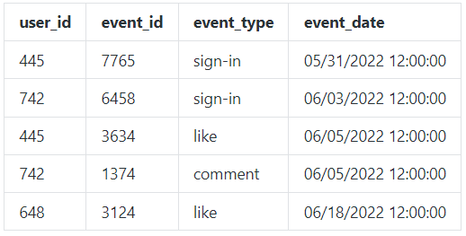
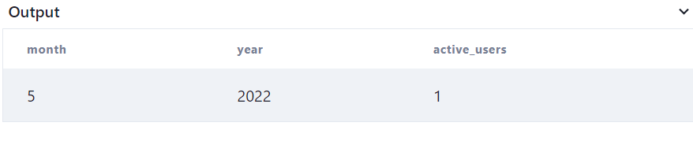

# Active_User_Retention_SQL
## This project involves finding the active users of a website in a given month.
## Business Understanding
Tracking monthly active users (MAUs) is a common practice for websites and online platforms for several reasons:
  * Performance measurement: MAUs provide a key performance indicator (KPI) that helps website owners and operators assess the overall health and performance of their site. By monitoring MAUs over time, website owners can gauge the popularity, engagement, and retention of their website's users, and make data-driven decisions to optimize the site's performance.
  * Business strategy: MAUs can be used as a metric to evaluate the success of a website's business strategy. Higher MAUs may indicate increased user adoption, retention, and engagement, which can be important for websites that rely on advertising revenue, subscriptions, or other business models. MAUs can help track the effectiveness of marketing efforts, product updates, and user retention strategies, and inform future business decisions.
  * User experience improvement: Tracking MAUs can provide insights into how users interact with a website, which can help identify areas for improvement in terms of user experience. By analyzing MAU data, website owners can identify patterns, trends, and user behavior, which can be used to optimize the website's design, content, functionality, and overall user experience.
  * Benchmarking and comparison: MAUs can be used to benchmark a website's performance against industry peers or competitors. Understanding how a website's MAUs compare to similar websites or industry standards can provide valuable insights into the website's relative position in the market, potential areas for improvement, and opportunities for growth.
  * Reporting and communication: MAUs are often used as a key metric in reporting to stakeholders, investors, or partners. Tracking and reporting MAUs can help convey the website's user base and engagement levels, which can be important for communication purposes, financial reporting, and business development activities.
## Data Understanding
The user_acions table below shows the activities of users on a website. These table will be queried to find the monthly active users.  

## SQL Query
SELECT EXTRACT(MONTH FROM event_date) AS Month,  
       EXTRACT(YEAR FROM event_date) AS Year,  
       COUNT(DISTINCT user_id) AS Active_Users  
FROM user_actions  
WHERE EXTRACT(MONTH FROM event_date) = 5  
AND EXTRACT(YEAR FROM event_date) = 2022  
GROUP BY EXTRACT(MONTH FROM event_date), EXTRACT(YEAR FROM event_date);  
### Query Explanation
  * SELECT EXTRACT(MONTH FROM event_date) AS Month, EXTRACT(YEAR FROM event_date) AS Year, COUNT(DISTINCT user_id) AS Active_Users: This line specifies the columns to be selected in the result. It uses the EXTRACT() function to extract the month and year from the event_date column, and aliases them as Month and Year, respectively. It also uses the COUNT() function to count the distinct user_id values, and aliases the result as Active_Users.
  * FROM user_actions: This specifies the table from which the data will be retrieved, in this case, the user_actions table.
  * WHERE EXTRACT(MONTH FROM event_date) = 7 AND EXTRACT(YEAR FROM event_date) = 2022: This line specifies the conditions for filtering the data. It uses the EXTRACT() function again to extract the month and year from the event_date column, and compares them to the values 7 and 2022, respectively. This ensures that only events that occurred in July 2022 will be included in the result.
  * GROUP BY EXTRACT(MONTH FROM event_date), EXTRACT(YEAR FROM event_date): This line specifies the grouping of the data. It groups the rows by the extracted month and year values from the event_date column, so that the subsequent aggregation function (COUNT() in this case) is applied to each group separately.
  * The result of this query will be a table with three columns: Month, Year, and Active_Users. It will show the month and year for which the count of distinct active users is calculated based on the events that occurred in that particular month and year from the user_actions table.
 ## Results
 
 ## Conclusion
Overall, tracking monthly active users can provide valuable data and insights for website owners and operators to measure performance, inform business strategies, improve user experience, benchmark against competitors, and communicate with stakeholders.
